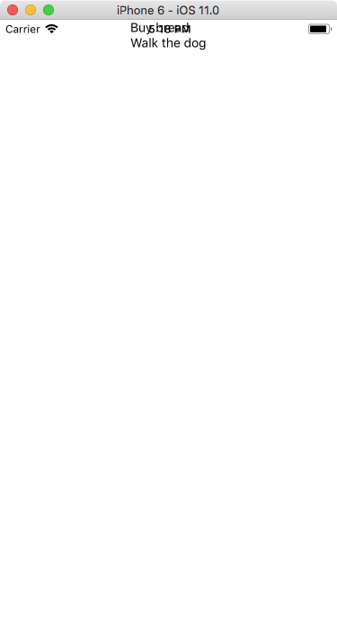

# Viewing our to-do items

The first thing I'd like to do when building an application is think about what kind of _data_ we're working with. Since we're building a to-do list application, we're going to store a list of items. Each item will have the text of the to-do, of course, but also some extra information, such as if the item was completed or not. Also, React requires us for each item to have a unique key: for that we're going to use the current date and time \(which, since it is stored internally in milliseconds, should never have two duplicate keys\).

Let's add some dummy data at the top of our `App.js`, right below our `import` statements:

```js
const items = [
  {key: 1507129580608, text: 'Buy bread', complete: false},
  {key: 1507129597587, text: 'Walk the dog', complete: false},
]
```

Since we don't have any user interface at all, let's start by _rendering_ our list of items. In React we're going to use a [FlatList](https://facebook.github.io/react-native/docs/flatlist.html) for this. It requires us to give a list of items \(which we have\) and a _rendering function_: something React will call for every item \(actually, just for the items that are _on screen_; invisible items will not be rendered\).

Let's import `FlatList` from `react-native` \(add it to the import statement at the top, after `Text` and `View`\). Then, replace the `<Text>` component with a `<FlatList>` like this:

```js
<FlatList data={items} renderItem={this.renderItem.bind(this)} />
```

Pretty simple, except for the weird "bind" thing. Ignore that for now — we'll talk about it later. Let's write this `renderItem` function. Add it below the `render()` function. It will take in an item and return a `<Text>` element for each item.

```js
renderItem(item) {
  return <Text>{item.item.text}</Text>;
}
```

If we save our document, the simulator should automatically refresh, showing us this _hideous_ view \(I told you it wasn't going to be pretty!\)



We haven't defined any margins, meaning we just render _over_ the status bar on iOS. Let's add a little bit of margin to the container view. In the `container` style properties at the bottom, add `paddingTop: 30,` to the list \(if you're adding this after `justifyContent` make sure that line has a trailing comma!\).

We're going to do a bit more of styling: we'll make every item align to the left, and add some padding and font styling.

To do that we're going to wrap every item in a `<View>`. Change the code in `renderItem` to look like this:

```js
<View style={styles.item}>
  <Text style={styles.itemText}>{item.item.text}</Text>
</View>
```

Also in the `<FlatList>` tag, add `style={styles.itemList}`. Now let's set those styles:

```js
itemList: {
  width: '100%'
},
item: {
  flex: 1,
  alignItems: 'flex-start',
  flexDirection: 'row',
  padding: 10,
  borderBottomColor: '#eee',
  borderBottomWidth: 1
},
itemText: {
  fontSize: 24,
  color: '#444'
}
```

Here's a short overview of the styling information:

* We set the itemList to a width of 100%, so it takes up the entire page. Note that we have to write this as a string, since this is just regular JavaScript and it doesn't understand values with units like CSS.
* We style an item by adding some flex information. This is currently unnecessary, but will be useful once we start adding additional controls for every row item \(like a complete checkbox and a delete icon\). The bottom border is similar to how we would it do it in CSS \(although we can't use shorthand properties\).
* The itemText just has a fontSize and color. We can use named colors \('red', 'green', ...\), hexadecimal values, and rgba/hsl combinations, just like in CSS.

Note that this is just one way of styling the controls: experiment with the colors and font sizes to make it your own!
