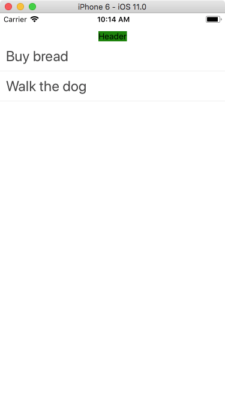
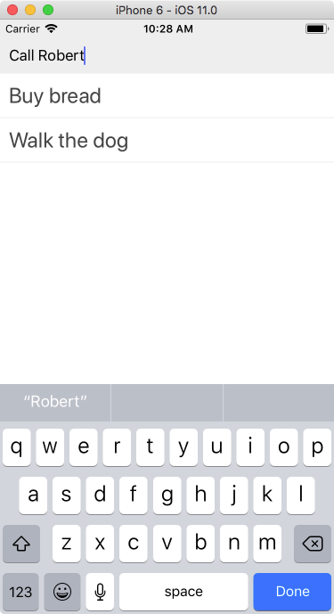

## Adding a to-do item

Add the top of our app we're going to add a text input where we can add new to-do items. We're going to put this in a custom `<Header>` component that we'll store in a separate file.

Create a new file called **Header.js** in the root directory of our project \(so next to the **App.js** file\). In Visual Studio Code, choose "New File" from the "File" menu and immediately save it with the name Header.js.

Let's fill it up: every component needs three things: a list of imports, a default class, and a style sheet. We're going to make a very basic header to check if it works first, then fill it in with our text input. Here's our basic file:

```js
import React from 'react';
import { StyleSheet, Text, View } from 'react-native';

export default class Header extends React.Component {
  render() {
    return (
      <View style={styles.container}>
        <Text>Header</Text>
      </View>
    );
  }
}

const styles = StyleSheet.create({
  container: {
    backgroundColor: 'green'
  }
});
```

Note that I've used green as the background color to make the component stand out. I probably don't want to leave that in, but for testing it's immediately clear where this component is.

Now let's import this component in our `App.js` and display it. First, add another import line after the `react` and `react-native` lines:

```js
import Header from './Header';
```

Then, in our render method, add a `<Header />` \(note the slash!\) right after our opening `<View>` tag \(and before the `<FlatList>`\). Save and you should see the smallish header appear:



We're going to have the background of the header span the entire top of our app. Remove the `paddingTop: 30` from the `container` in App.js. Then, go in Header.js and edit the styles:

```js
const styles = StyleSheet.create({
  container: {
    paddingTop: 30,
    paddingBottom: 10,
    paddingHorizontal: 10,
    backgroundColor: '#eee',
    flexDirection: 'row',
    width: '100%'
  }
});
```

This should put the header across the entire top part of the screen.

Let's replace the `<Text>` with a `<TextInput>` control. Import `TextInput` by adding it to the imports from `react-native`. Replace the `<Text>` tag with a `<TextInput>` tag that looks like this:

```js
<TextInput
  style={styles.input}
  placeholder="Add To-do"
  returnKeyType="done"
  underlineColorAndroid="transparent"
/>
```

\(Note that we have some Android-specific styling set here - you can find all properties in the [TextInput reference](https://facebook.github.io/react-native/docs/textinput.html)\).

Add the styling information for the text input. Note that we have to add a comma after the closing bracket of the container styling!

```js
...styling for the container...
},
input: {
  flex: 1
}
```

If we save the file we should see the text input:



Clicking it allows us to type in something \(In the iOS Simulator you might need to go to Hardware &gt; Keyboard and choose "Toggle Software Keyboard" to see the on-screen keyboard\).

However once we press done or enter, nothing happens: the item is not saved, and our text is not cleared from the input field. That's because we haven't told our app what to do once the text input is _submitted_. Let's do that now.

