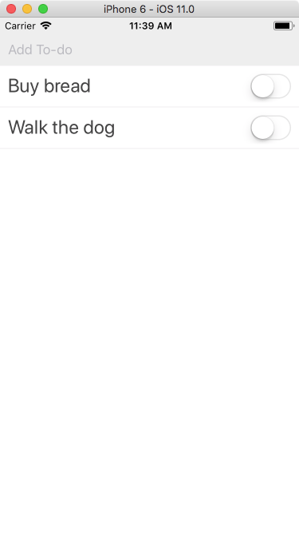
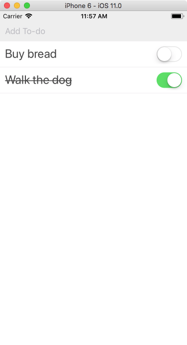

## Completing an item

We now have a list of to-do items, but we want to be able to mark them off as done once we've actually completed them. To do that we're going to add a [Switch](https://facebook.github.io/react-native/docs/switch.html) component that can be toggled between "on" and "off".

Since our to-do item will be more than a single `<View>` with `<Text>` field we're going to put it in its own file, called `TodoItem.js`. Make that new file and place the following code:

```js
import React from 'react';
import { StyleSheet, Text, View, TextInput, Switch } from 'react-native';

export default class TodoItem extends React.Component {
  render() {
    const item = this.props.item;
    return (
      <View style={styles.item}>
        <Text style={styles.itemText}>{item.text}</Text>
        <Switch value={item.complete} />
      </View>
    );
  }
}

const styles = StyleSheet.create({
  item: {
    flex: 1,
    alignItems: 'flex-start',
    flexDirection: 'row',
    justifyContent: 'space-between',
    padding: 10,
    borderBottomColor: '#eee',
    borderBottomWidth: 1
  },
  itemText: {
    fontSize: 24,
    color: '#444'
  }
});
```

We recognize the structure from the Header class: first some imports, then the default class, and finally some styles. I've already added the `Switch` component, although it doesn't actually work yet: we'll do that later.

Now back in our App.js import the TodoItem at the top:

```js
import TodoItem from './TodoItem';
```

Then in `renderItem` replace all the components with our `<TodoItem>`:

```js
renderItem(item) {
  return <TodoItem item={item.item} />;
}
```

Finally, remove the `item` and `itemText` styles from the App style sheet \(we've moved them over to our to-do item class\). If you refresh you should see the switches next to each item:



Toggling them doesn't do anything yet, so let's change that. Write a `onToggleItem` in App.js \(below `onAddItem` is a good spot\):

```js
onToggleItem(key, complete) {
  const newItems = this.state.items.map(item => {
    if (item.key !== key) return item;
    return { ...item, complete };
  });
  this.setState({ items: newItems });
}
```

This looks more complex than just changing a `complete` flag. That's because we want to keep the old value around. The `map` function builds a new list. For each item of the list, we're going to check if it's the one we're changing. If not, we'll just return it. If it is, we copy all properties in it, except for complete which we replace \(`{ ...item, complete }`\).  Then, we set the state to our new items.

In `renderItem()` we also have to pass in our `onToggleItem` method like this:

```js
renderItem(item) {
  return (
    <TodoItem
      item={item.item}
      onToggleItem={this.onToggleItem.bind(this, item.item.key)}
    />
  );
}
```

Because we also want to know the current key, our `bind` not just includes `this`, but also the `key` of the item we're rendering. We'll talk more about binding in the JavaScript refresher chapter.

Finally, in our `TodoItem.js` file add `onValueChange` to the `<Switch>` component:

```js
<Switch value={item.complete} onValueChange={this.props.onToggleItem} />
```

We should now be able to switch between completed and non-completed. However, our text stays looking just the same. We'll provide some styling changes: it's up to you to make it a bit more fancy.

First define a `complete` style in the TodoItem stylesheet:

```js
complete: {
  textDecorationLine: 'line-through'
},
```

We'll apply this style to the `<Text>` inside of our to-do item. As you can see, it will cross off our item.

In the `<Text>` component change the style to look like this:

```js
<Text style={[styles.itemText, item.complete && styles.complete]}>{item.text}</Text>
```

Our style attribute is now a list containing the original `itemText` style and a conditional style: the double ampersand means: only apply this style if `item.complete` is true.

Save it, check off an item in the app and see how it appears. Experiment with the styling, for example by changing the text color. You can also apply different styles to the `item` view and change the background color.


