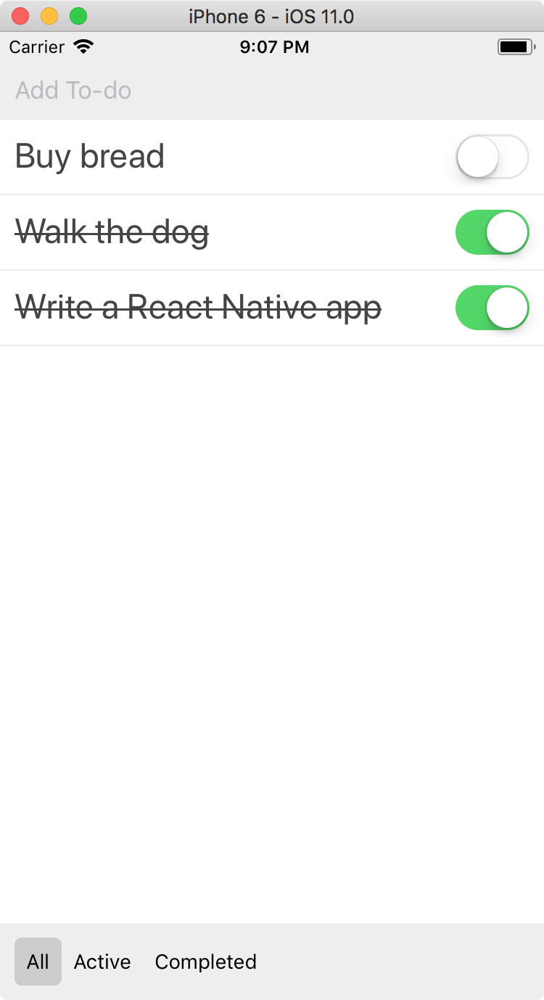

# Filtering items

Our basic application is done, so we're adding a couple of extra features. First up is filtering our items: at the bottom we want to see a status line that allows us to select between all items, active items and completed items. We're going to build these controls in a new custom `<Footer>` control.

Create a new file called Footer.js, and populate it with the basics:

```js
import React from 'react';
import { StyleSheet, Text, View } from 'react-native';

export default class Footer extends React.Component {
  render() {
    return <View style={styles.footer} />;
  }
}

const styles = StyleSheet.create({
  footer: {
    backgroundColor: '#eee',
    width: '100%',
    flexDirection: 'row',
    alignItems: 'center',
    justifyContent: 'space-between',
    padding: 10
  }
});
```

Like before, import it in App at the top:

```js
import Footer from './Footer';
```

Then add the filter to the `render` method, right before the closing `</View>` tag.

```js
<Footer />
```

To add the filters we want to make three button states. We want to be able to do our own styling so we won't use actual buttons but `<TouchableOpacity>` components. Because we'll be adding some extra components in the footer, we'll wrap our TouchableOpacity items in a nested `<View>`:

```js
<View style={styles.footer}>
  <View style={styles.filters}>
    <TouchableOpacity style={styles.filter} onPress={() => this.props.onFilter('all')}>
      <Text>All</Text>
    </TouchableOpacity>
    <TouchableOpacity style={styles.filter} onPress={() => this.props.onFilter('active')}>
      <Text>Active</Text>
    </TouchableOpacity>
    <TouchableOpacity style={styles.filter} onPress={() => this.props.onFilter('completed')}>
      <Text>Completed</Text>
    </TouchableOpacity>
  </View>
</View>
```

We've created three of them, each with a `<Text>` component inside with the text All / Active / Completed. We'll want to style them like this:

```js
filters: {
  flexDirection: 'row'
},
filter: {
  padding: 8
}
```

We've already included a call to `onFilter`, but we haven't passed that method yet from the App. Our `onFilter` method just sets a new state flag in the app called `filter` to one of the three values \(`all`, `active` or `completed`\):

```js
onFilter(filter) {
  this.setState({ filter });
}
```

Then, instead of our rendering all of our items all the time, we're going to render just a selection, based on which filter we've selected. To do that, we're going to make a new `filteredItems` constant inside of our render function that looks like this:

```js
const filteredItems = this.state.items.filter(item => {
  if (this.state.filter === 'all') {
    return true;
  } else if (this.state.filter === 'active' && !item.complete) {
    return true;
  } else if (this.state.filter === 'completed' && item.complete) {
    return true;
  } else {
    return false;
  }
});
```

Then change the `<FlatList>` component to take in the `filteredItems`:

```js
<FlatList
  style={styles.itemList}
  data={filteredItems}
  renderItem={this.renderItem.bind(this)}
/>
```

Try adding some items, marking some items as completed, switching around between the different filters,... You should see that the items end up in the correct place.

There is only one issue: we can't see which filter is currently selected. Note that we set the current filter in the app state. All we have to do is pass it down to the Footer component, then change the styling based on its value.

First, change the `<Footer>` tag in App.js to send along the current filter state:

```js
<Footer filter={this.state.filter} onFilter={this.onFilter.bind(this)} />
```

In Footer.js we'll add a `selected` style to our style sheet, like so:

```js
selected: {
  backgroundColor: '#ccc'
}
```

This sets the background color of the selected item to a darker gray. I've also added `borderRadius: 5` to the `filter` style so that it has nice rounded corners.

Finally our `TouchableOpacity` components need to include the `selected` style if the filter is equal to theirs. We first extract out the filter from the properties. Right at the beginning of the `render` method write the following line:

```js
const filter = this.props.filter;
```

We then use the double-ampersand technique for each of the items:

```js
<TouchableOpacity
  style={[styles.filter, filter === 'all' && styles.selected]}
  onPress={() => this.props.onFilter('all')}
>
  <Text>All</Text>
</TouchableOpacity>
<TouchableOpacity
  style={[styles.filter, filter === 'active' && styles.selected]}
  onPress={() => this.props.onFilter('active')}
>
  <Text>Active</Text>
</TouchableOpacity>
<TouchableOpacity
  style={[styles.filter, filter === 'completed' && styles.selected]}
  onPress={() => this.props.onFilter('completed')}
>
  <Text>Completed</Text>
</TouchableOpacity>
```

This looks like a lot of code but it's just the same trick, repeated three times. For each style property we include `styles.filter`. We then check if the `filter` is equal to our value (e.g. `all`) and *only then* include `styles.selected`. This ends up only including it for the filter that's currently selected.


