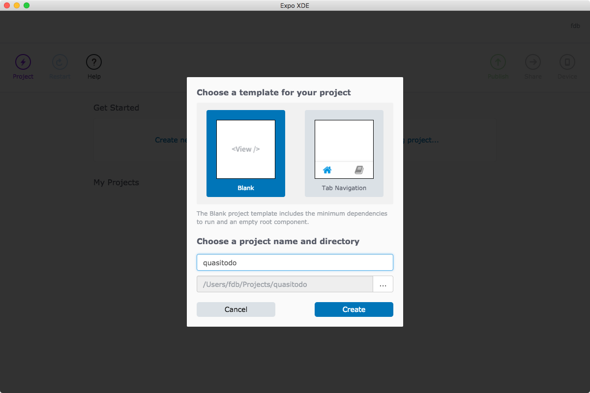

# Building Our First App

We're going to build our first small to-do list app that allows us to create new items and mark of items as done. This is a bit the "hello world" of apps but it shows us a good tour of everything we can do: adding items, marking them as complete, deleting items, ... We'll focus on the functionality, not on the visual looks, so our app won't exactly look very sexy. That's why we'll call it **"Quasitodo"**. So let's get started!

To do this we're going to install the Expo XDE on our machine. This is one step up from Expo Snack: we still have the convenience of running everything directly on our phone, but our project is now a self-contained folder on our computer.

Expo Snack is very useful for small one-offs: experimenting with a certain control, trying out small style tweaks without installing anything, building apps on the go. However, for serious app development we need an environment that can contain multiple source files as well as assets such as images or sounds.

## Installing Expo & Visual Studio Code

Visit [expo.io/tools](https://expo.io/tools) and click the download button for your platform. Then, visit [code.visualstudio.com](https://code.visualstudio.com/) and download Visual Studio Code, an open-source, cross-platform editor by Microsoft.

Open the Expo XDE. You should have the option to create a new project. Call it "quasitodo".



Let it do its thing for a bit. Click on the "Device" button in the toolbar and choose "Open on iOS Simulator" \(or Android if you're on Windows\). This should open the emulator with a piece of text in the middle. Then, click the project lightning bolt icon and choose "Open in Editor". This should open the entire project in Visual Studio Code.

## Examining our project

If we look in the sidebar we see that we have a lot more than just one file! We now have a directory containing multiple folders \(`assets`, `node_modules`\) and multiple cryptic files. For now, we're just going to focus on the _entry point_ of our application, which is `App.js`. It looks like this:

```js
import React from 'react';
import { StyleSheet, Text, View } from 'react-native';

export default class App extends React.Component {
  render() {
    return (
      <View style={styles.container}>
        <Text>Open up App.js to start working on your app!</Text>
      </View>
    );
  }
}

const styles = StyleSheet.create({
  container: {
    flex: 1,
    backgroundColor: '#fff',
    alignItems: 'center',
    justifyContent: 'center',
  },
});
```

This is a good starting point for building out our app, so we'll leave this code in for now.
