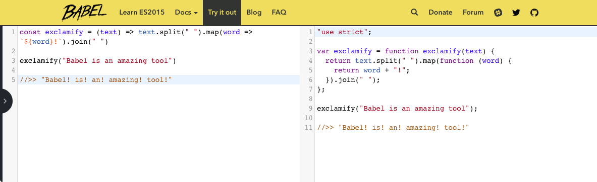

# A Refresher on JavaScript

JavaScript has evolved a lot in recent years. And although you can certainly still plunk some jQuery and a JavaScript file in a website, modern JavaScript is a lot more... well, modern.

"Modern JavaScript" is a bit of an ambiguous name, so we'll refer to it by its official name: ES6. ES6 stands for ECMAScript 6 \(ECMA is the organisation that standardizes JavaScript\), aka JavaScript 2015. Newer versions exist, but browser support is always lagging behind a bit \(more on that later\) so we'll focus on ES6.

This update solves a number of big issues JavaScript historically has, most notably:

* Should I put everything in one big file \(that's really hard to edit\) or spread it out over small modules \(but increase load times\)?
* If I include many small scripts in my project, will that pollute the global namespace? \(e.g. the `$` operator of jQuery that's available everywhere in the window\)
* If I declare a variable in a loop, why is it still available outside of the loop?

We'll go through the solutions to all of these issues. But first what good is a new version if nobody's using it? Let's talk about browser support.

## Browser Support

It's one thing to write up a wish list of features for JavaScript \(e.g. "standards"\). It's another thing to have those be implemented in all common browsers. Sometimes it takes _years_ before all features work on every browser and platform. Clearly, that won't do.

So some developers thought of writing a program that takes your fancy ES6 code, and _transpiles_ it to older code that works everywhere. That means your code can use all the latest features, but is converted down to a version of JavaScript that is supported in all browsers. That way, whenever a new feature comes out, we don't have to wait for every browser vendor \(Internet Explorer, Chrome, Firefox\) to implement it: using a transpiler, we can use all features immediately!

The most famous transpiler is called **Babel**. As the name suggests, it converts from one language into another. Weirdly enough, both of those languages is JavaScript.

Being a program, Babel needs to be run every time our source code changes. This is often done through [Webpack](https://webpack.js.org/), which combines and packs all your JavaScript files into a single bundle file.

Lucky for us, the React Native tools already have Babel and Webpack set up, so we don't need to worry about any of this: we can just hit save and see the new version on our phones.

We'll be trying out some ES6 features as part of this chapter. All of them should just work in a recent version of Firefox or Chrome, so if we're only running our software on those platforms, we don't need Babel.
