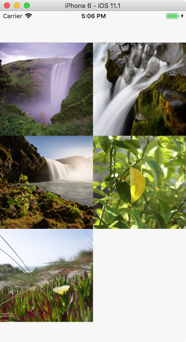
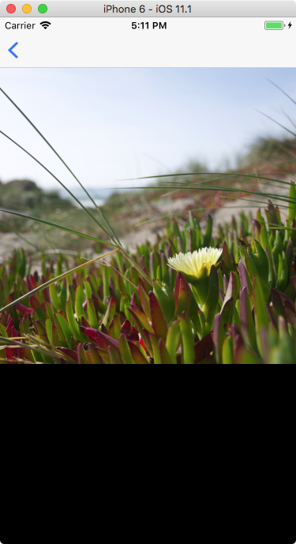

# Adding Navigation

We've mainly focused on one screen. However, most apps will have _lots_ of screens, so we need a way to move between them.

React Native and Expo don't include a standard way of moving between screens. Instead, they defer this functionality to a separate module. We're going to use [react-navigation](https://reactnavigation.org/), since it seems to be the recommended one, but know that there are others that all have slightly different ways of working.

The basic idea of navigating between screens is that we need to define _how_ we navigate and what happens when we _go back_.

There are many ways to think about navigation. For example, your app might have a **tab bar** at the bottom. Each of those tabs will be a separate screen, and we can switch between them. Alternatively, your app might have a **drawer** \(also called the "hamburger menu"\) that slides in from the side, and allows you to switch around between screens. In addition, some screens you can only get to when you click on something, and you can press the **back button** to go back one screen.

The react-navigation library supports all of these navigation styles. In our example, we're going to make a simple photo viewer that is built using a simple list-detail navigation style. When we open the app, we see a list of images. We can then tap on a thumbnail to see the image up close. To go back, we hit the back button.

Create a new project in the Expo XDE or using the command line:

```bash
exp init photoview
```

Choose the template "blank" when asked.

Open the project and run it on your phone. In the command line you would use:

```bash
cd photoview
npm install
exp start
```

We're going to need the `react-navigation` module. We'll install it on the command line using `npm`. Open a new Terminal, then type:

```bash
cd photoview
npm install --save react-navigation
```

This will add the package to `package.json` and install the required dependencies under the `node_modules` folder.

## Adding screens

Using react-navigation, we can think of our application as a list of _screens_. Each screen has its own functionality, and is basically it's own `App.js`. We're going to make two screens:

* A `PhotoList` screen that will show a list of photo thumbnails.
* A `PhotoDetail` screen that will show a single photo.

Let's begin by setting up our App.js. Replace _all_ code in the App.js file with this:

```js
import React from 'react';

import { StackNavigator } from 'react-navigation';
import PhotoListScreen from './PhotoListScreen';
import PhotoDetailScreen from './PhotoDetailScreen';

export default (App = StackNavigator({
  PhotoList: { screen: PhotoListScreen },
  PhotoDetail: { screen: PhotoDetailScreen }
}));
```

Note that this refers to two files that we still have to create: `PhotoListScreen.js` and `PhotoDetailScreen.js`. Let's do that now.

Let's stub those out first. PhotoListScreen.js will look like this:

```js
import React from 'react';
import { View, Text, StyleSheet } from 'react-native';

export default class PhotoListScreen extends React.Component {
  constructor(props) {
    super(props);
  }

  render() {
    return (
      <View style={styles.container}>
        <Text>This is the PhotoListScreen</Text>
      </View>
    );
  }
}

const styles = StyleSheet.create({
  container: {
    flex: 1,
    backgroundColor: '#f7f7f7'
  }
});
```

The `PhotoDetailScreen.js` file will look almost exactly the same:

```js
import React from 'react';
import { View, Text, StyleSheet } from 'react-native';

export default class PhotoDetailScreen extends React.Component {
  constructor(props) {
    super(props);
  }

  render() {
    return (
      <View style={styles.container}>
        <Text>This is the PhotoDetailScreen</Text>
      </View>
    );
  }
}

const styles = StyleSheet.create({
  container: {
    flex: 1,
    backgroundColor: '#f7f7f7'
  }
});
```

However, we can't _get_ to the PhotoDetail screen, since we start up in PhotoList and there is no way to navigate to it. We have to do this ourselves. But first, let's fill up the photo list.

## The Photo List Screen

The PhotoListScreen will get a list of images from the "camera roll". First, add `CameraRoll` to our `react-native` imports. Then in the constructor, prepare the state so that we're ready to receive our photos:

```js
constructor(props) {
  super(props);
  this.state = { photos: [] };    
}
```

Now we can create a `componentDidMount` method below the constructor that will load the photos from the camera roll:

```js
componentDidMount() {
  CameraRoll.getPhotos({ first: 25 })
    .then(r => this.setState({ photos: r.edges }));
  }
}
```

We ask the `CameraRoll` object to get the first 25 photos. On iOS, this will show a permission popup; on Android in the Expo app, this will silently fail. You have to go to Apps &gt; Expo &gt; Permission and explicitly enable the "external storage" permission.

Once we have the photos set in the state object, we can display them in the render method:

```js
render() {
  return (
    <View style={styles.container}>
      <ScrollView contentContainerStyle={styles.scrollViewContent}>
        {this.state.photos.map((photo, index) => (
          <TouchableHighlight
            key={index}
            onPress={this.onChooseImage.bind(this, photo, index)}
          >
            <Image
              key={index}
              style={styles.image}
              source={{ uri: photo.node.image.uri }}
            />
          </TouchableHighlight>
        ))}
      </ScrollView>
    </View>
  );
}
```

Also add `ScrollView`, `TouchableHighlight` and `Image` to the list of imports from `react-native`.

Note that we're referring to the `onChooseImage` method, which doesn't exist yet. We'll come back to that in a minute.

We can add some styling to make the images look better. Note that we're declaring a constant called `BOX_SIZE` to the width of the window divided by 2: this will place two images right next to each other. Don't forget to add `Dimensions` to the list of imports from `react-native`.

```js
const BOX_SIZE = Dimensions.get("window").width / 2;

const styles = StyleSheet.create({
  container: {
    flex: 1,
    backgroundColor: "#f7f7f7"
  },
  scrollViewContent: {
    flexDirection: "row",
    flexWrap: "wrap"
  },
  image: {
    width: BOX_SIZE,
    height: BOX_SIZE
  }
});
```

 Now let's write the `onChooseImage` method which will be called when we touch an image. It's quite simple:

```js
onChooseImage(photo, index) {
  const navigate = this.props.navigation.navigate;
  navigate("PhotoDetail", { photo, index });
}
```

The function receives a `photo` parameter containing all information about the photo, and an index, the number of the photo. It then looks for the `navigation` object, which is passed to us through the `StackNavigator`. This contains a `navigate` function that we can call with the name of the screen, and any parameters we want to pass. Here, we pass the `photo` and `index` as named parameters.

We should now be able to touch a photo and get to the photo detail screen, even though that screen doesn't show anything useful at the moment.



## The Photo Detail Screen

We'll keep the detail screen simple: we're only going to show the image in full resolution. The back button will be handled by `react-navigation`.

We'll start by updating our imports:

```js
import React from "react";
import { View, Text, StyleSheet, Image, Dimensions } from "react-native";
```

Then we'll update our render method. Here, we get the information from the navigation object through the `state` property, and then the `params` property. Those `params` contain the objects we sent through when we called `navigate`.

```js
render() {
  const { params } = this.props.navigation.state;

  return (
    <View style={styles.container}>
      <Image
        style={styles.image}
        source={{ uri: params.photo.node.image.uri }}
      />
    </View>
  );
}
```

Finally, we'll style the screen:

```js
const BOX_SIZE = Dimensions.get("window").width;

const styles = StyleSheet.create({
  container: {
    flex: 1,
    backgroundColor: "#000"
  },
  image: {
    width: BOX_SIZE,
    height: BOX_SIZE
  }
```

And we're done! As an exercise, try styling the image further, center it, or make it fill the screen.

});
