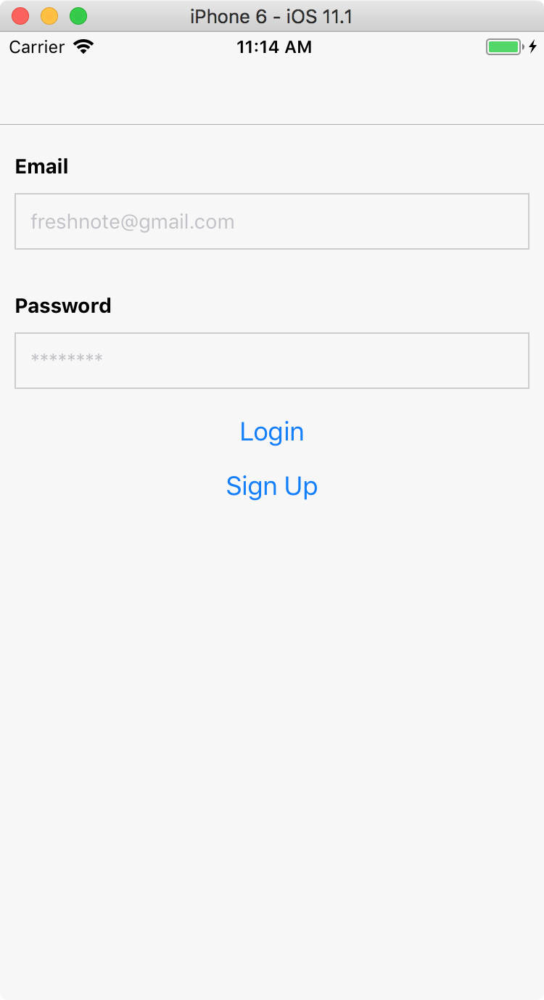

# The Login and Sign Up Screen

When we start the app, we want to present our users with a screen that allows them to sign up for a new account, or login if they already have an account. We'll combine those into one screen, but you can create multiple screens if you like. This is what we're going to make:



First, let's add our app to the navigation. Go to App.js and add an import to our to-be-created file:

```js
import LoginScreen from './LoginScreen';
```

Then add a navigation key to the `StackNavigator`. It will look like this:

```js
const AppNavigator = StackNavigator({
  Login: { screen: LoginScreen },
  NoteList: { screen: NoteListScreen },
  NoteDetail: { screen: NoteDetailScreen }
});
```

Now, create a new file called `LoginScreen.js`. Add the following imports:

```js
import React from 'react';
import { View, Text, TextInput, Button, StyleSheet, ActivityIndicator } from 'react-native';
import firebase from 'firebase';
```

We'll go through the component piece by piece. You can find the full code at [GitHub](https://github.com/fdb/byoa/blob/master/apps/freshnote/LoginScreen.js).

```js
export default class LoginScreen extends React.Component {
  constructor(props) {
    super(props);
    this.state = { email: '', password: '', error: '', loading: false };
  }
```

Our constructor sets a number of state items:
- **email** will hold the input text for the email address.
- **password** will hold the password text.
- **error** contains an error message if we tried to log in / sign up and failed.
- **loading** is a boolean that we will toggle when we do a request to Firebase. It replaces the buttons with a spinning `ActivityIndicator`.

```js
componentDidMount() {
  firebase.auth().onAuthStateChanged(user => {
    if (user) {
      this.props.navigation.navigate('NoteList');
    }
  });
}
```

This code checks if we are *already* logged in. This happens every time we open the app again. We then immediately navigate to the `NoteList` screen.

```js
onLoginPress() {
  this.setState({ error: '', loading: true });

  const { email, password } = this.state;
  firebase
    .auth()
    .signInWithEmailAndPassword(email, password)
    .catch(e => {
      this.setState({ error: `Login failed: ${e.message}`, loading: false });
    });
}
```

When we press the login button, a number of things happen. First, because we make a network request, we set `loading` to true. This means we can't press the login or sign up button twice.

We extract `email` and `password` from the state and pass them to Firebase's `signInWithEmailAndPassword` method. This method returns a `Promise`: something that will return a result later. On this method, we `catch` the error and show the error to the user by setting the `error` message state.

Note that we don't attach a method that gets called when login is successful. That's because we already attached an `onAuthStateChanged` method that will be triggered when a user changes from logged out to logged in, so that will take care of switching to the `NoteList` page.

The onSignUpPress method looks very similar:

```js
onSignUpPress() {
  this.setState({ error: '', loading: true });

  const { email, password } = this.state;
  firebase
    .auth()
    .createUserWithEmailAndPassword(email, password)
    .catch(e => {
      this.setState({ error: `Sign up failed: ${e.message}`, loading: false });
    });
}
```

The only difference is that we call `createUserWithEmailAndPassword`. Note that this function will also automatically log in the user with the newly created account details.

With the utility methods out of the way we can focus on rendering the component. Here's the render method:

```js
render() {
  return (
    <View style={styles.container}>
      <Text style={styles.formLabel}>Email</Text>
      <TextInput
        style={styles.formInput}
        placeholder="freshnote@gmail.com"
        keyboardType="email-address"
        autoCapitalize="none"
        autoCorrect={false}
        onChangeText={email => this.setState({ email })}
      />
      <Text style={styles.formLabel}>Password</Text>
      <TextInput
        style={styles.formInput}
        placeholder="********"
        secureTextEntry={true}
        onChangeText={password => this.setState({ password })}
      />
      {this.renderButtons()}
      <Text style={styles.formError}>{this.state.error}</Text>
    </View>
  );
}
```

It's a big method, but most of it is just setting properties. Note that we use a number of properties to support email addresses better (`keyboardType`, `autoCapitalize`, `autoCorrect`) and that we use   `secureTextEntry` for the password input field so nobody can shoulder-surf our password.

This method refers to `renderButtons`. This method simply switches between a loading spinner and the two buttons:

```js
renderButtons() {
  if (this.state.loading) {
    return <ActivityIndicator />;
  } else {
    return (
      <View>
        <Button title="Login" onPress={this.onLoginPress.bind(this)} />
        <Button title="Sign Up" onPress={this.onSignUpPress.bind(this)} />
      </View>
    );
  }
}
```

Finally don't forget to close of our class:

```js
}
```

Let's add some styles:

```js
const styles = StyleSheet.create({
  container: {
    flex: 1,
    backgroundColor: '#f7f7f7'
  },
  formLabel: {
    fontWeight: 'bold',
    marginRight: 10,
    marginLeft: 10,
    marginTop: 20
  },
  formInput: {
    padding: 10,
    borderWidth: 1,
    borderColor: '#ccc',
    margin: 10
  },
  formError: {
    textAlign: 'center',
    color: 'red'
  }
});
```

Feel free to tweak the styles to your liking. You could also use something like [NativeBase](https://nativebase.io/) to use pre-made, styled form components.

And that's it! You should now be able to sign up for a new account, or login using an existing account. Note that logging in to the same account twice will have no effect (the loader will keep spinning). That's because `onAuthStateChanged` will not be triggered if we login as the _same_ user. You can experiment with creating two accounts and switching between both.