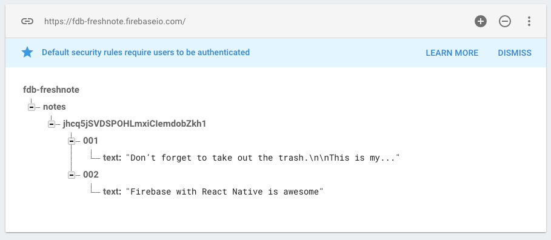

# Loading Data from Firebase

Currently, our `NoteListScreen` displays the default data. We want to display our actual notes.

But first, how do we store this data? In Firebase, we're free to structure the data however we want. The entire database is basically a giant JSON file. This will contain the data for all of our users. It is up to us to structure the data in a way that makes sense.

We'll store the data under a key `notes`, then the unique user id, then the key for a note, and then the note text. So for example:



Note that the user ID is something we get back from Firebase. The keys "001" and "002" are just examples. 

This means that note 1 for user "Dave" with user ID MKblPhx4loatGPFvRrGlaaMCfSp2 will have the following path:

```
notes/MKblPhx4loatGPFvRrGlaaMCfSp2/001
```

In Firebase we need to create a _ref_, which is a subsection of the database we want to listen to. We do that using `firebase.database().ref(key)` , where `key` is the "path" we want to observe. If we want to observe _all_ of the notes for a user, we'll use the path `notes/<userid>`.

Now the we know how we can access notes, let's update our `NoteListScreen`. First some clean-up: we'll use the `DEFAULT_NOTES` for when a user doesn't have any notes yet. However, Firebase will provide the key for us, so we have to take the `key` out of every item:

```js
const DEFAULT_NOTES = [
  { text: 'Welcome to Freshnote! Use the app for recording thoughts, large and small.' },
  { text: 'These are the default notes but you can delete them.' }
];
```

Import Firebase at the top of the file:

```js
import firebase from "firebase";
```

We'll then update  the constructor where we set the `notes` list to an empty list and add a `loading` flag:

```js
constructor(props) {
  super(props);
  this.state = { loading: true, notes: [] };
}
```

We'll add a `componentDidMount` method to the class that will actually load the data:

```js
componentDidMount() {
  const currentUser = firebase.auth().currentUser;
  console.assert(currentUser);
  const notesKey = `notes/${currentUser.uid}`;
  this.notesRef = firebase.database().ref(notesKey);
  this.notesRef.on('value', snap => {
    let notes = [];
    snap.forEach(child => {
      notes.push({ key: notesKey + '/' + child.key, text: child.val().text });
    });
    if (notes.length === 0) {
      notes = DEFAULT_NOTES;
      this.notesRef.set(DEFAULT_NOTES);
    }
    this.setState({ notes, loading: false });
  });
}
```

Again, there's a lot going on, so let's unpack it line by line.

```js
const currentUser = firebase.auth().currentUser;
```

Since the notes are stored under the UID of the current user, we need to fetch it from `firebase.auth()`.

```js
console.assert(currentUser);
```

Since we came to this screen through the `LoginScreen`, we should have a `currentUser` set. This assertion checks if that is the case, and throws an error if not. This can help us debug our app if this assumption is incorrect somehow.

```js
const notesKey = `notes/${currentUser.uid}`;
```

We'll construct the notesKey, the specific _path_ where our notes are stored. This consists of the fixed `notes` part and a variable UID that is unique per user.

```js
this.notesRef = firebase.database().ref(notesKey);
```

We'll create a reference to this part of the database and store it in a class variable called `notesRef`.

```js
this.notesRef.on('value', snap => {
```

On our `notesRef` we can attach a _listener_ that watches for change. Note that `value` is singular here, but it actually refers to _all_ the notes of the current user. Firebase will give us a _snapshot_ of the data.

We're going to create our notes list from the value object:

```js
let notes = [];
snap.forEach(child => {
  notes.push({ key: notesKey + '/' + child.key, text: child.val().text });
});
```

Since this is a tree, we ask the _parent_ value for its _children_. These are the individual note objects. These have some Firebase-specific info: a key and a value. For the key, we want the _entire_ key so we'll prepend our `notesKey` to the `childKey`. This mean each note will have a key that looks like:

```
notes/MKblPhx4loatGPFvRrGlaaMCfSp2/001
```

The other data is the text of each node. Here, we use the `val()` method to give us the value of each child, and then retrieve the text.

We push each note onto the list.

```
if (notes.length === 0) {
  notes = DEFAULT_NOTES;
  this.notesRef.set(DEFAULT_NOTES);
}
```

If we don't have any notes, we're going to re-use our DEFAULT_NOTES. Here, we use `this.notesRef.set` to immediately store these notes to the database.

```js
this.setState({ notes, loading: false });
```

Finally, we're set our notes in the state of the component. And since we're done loading we'll set loading to false.

Rendering will stay largely the same. However, we want to add a loading spinner whenever we're retrieving data from the database:

```js
render() {
  return (
    <View style={styles.container}>
      {this.state.loading && <ActivityIndicator style={styles.loading} />}
      <FlatList style={styles.noteList} data={this.state.notes} renderItem={this.renderItem.bind(this)} />
    </View>
  );
}
```

After all these changes, we have now successfully integrated Firebase into our app. Go back the Firebase console, switch to the Database tab, and you should see the notes of our user being loaded. What's more, since this is a _realtime_ database, we can change the text of the notes in the console and see the changes immediately in the app. Awesome!

