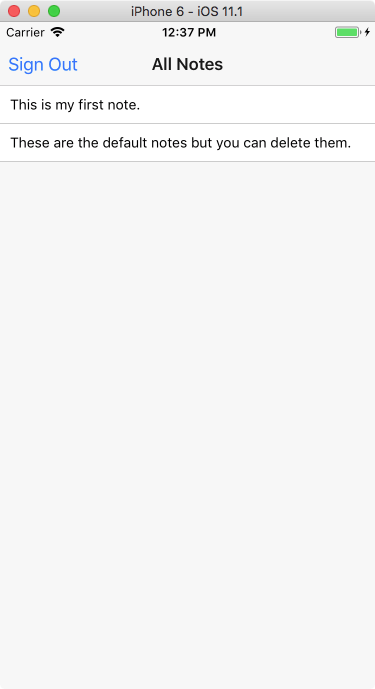

# Signing Out

Right now we can press the back button on our list screen to go back. This is a bit weird: it doesn't clearly convey the intent we're trying to do. We might want to add a "sign out" button here. Luckily, we can.

The navigation buttons are all managed by `react-navigation`, so we need to set this in the `navigationOptions`. The way this works is a bit weird. Because the `navigationOptions` are *static* (that is, they are connected to the class, not the instance) we can't just connect a button to `this.onSignOut`. Instead we pass it through navigation params. First, here are the new `navigationOptions`:

```js
static navigationOptions = ({ navigation }) => {
  const { params = {} } = navigation.state;
  return {
    title: 'All Notes',
    headerLeft: <Button title="Sign Out" onPress={params.onSignOut ? params.onSignOut : () => null} />
  };
};
```

Note the reference to `headerLeft`. This indicates the location of the UI. Here we make a `<Button>` and connect it to `params.onSignOut` (but only if they are defined).

So how do we set these parameters? We can see that they derive from the navigation *state*, so in our `componentDidMount` method we're going to set those params:

```js
componentDidMount() {
  // ... rest of the method, setting up Firebase...

    this.props.navigation.setParams({
    onSignOut: this.onSignOut.bind(this)
  });
}
```

So all we need is the `onSignOut` method. This will call `firebase.auth().signOut()`. This method returns a Promise that will fire when we are actually signed out, and we connect that to the `goBack` method of the navigation:

```js
onSignOut() {
  firebase
    .auth()
    .signOut()
    .then(() => {
      this.props.navigation.goBack();
    });
}
```

That should do it! We now have a "Sign Out" button instead of a back button, and clicking it signs us out and shows the login page.

