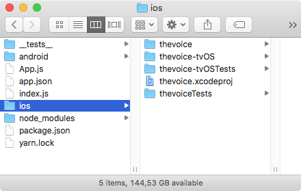
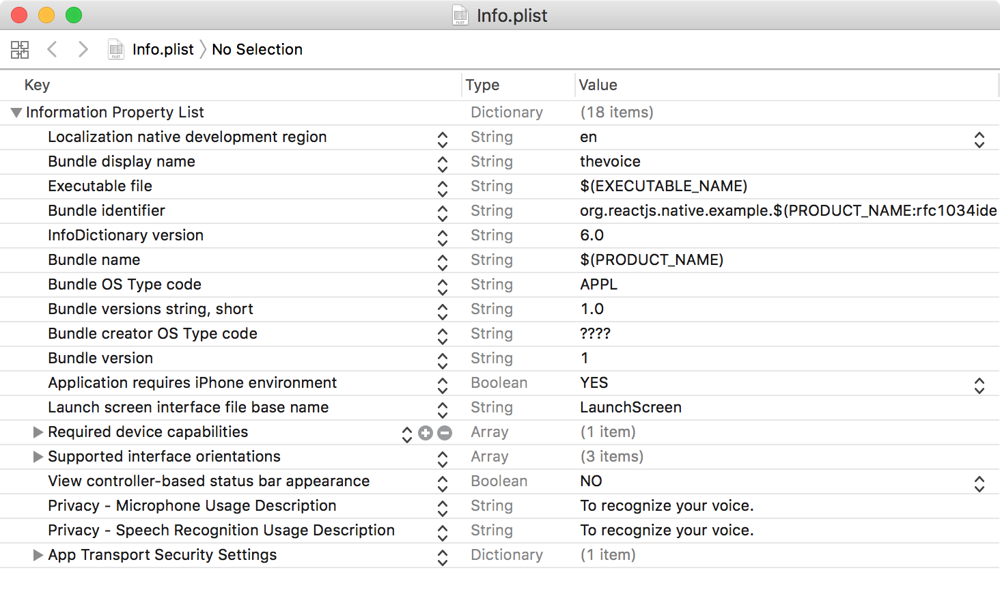

# Using Libraries

So far all the functionality we've used was available in JavaScript. We've used `react-navigation`, but this was also a JavaScript module. However some of the core functionality of the smartphone can only be accessed using the native APIs. For that, we need to create a React Native project with native modules.

Everything we've learned so far still counts! We're only adding to it by showing the parts that were hidden from view before.

Even if you don't need native extensions, you still need to learn this if you want to release your app on the App Store or Play Store, since that requires building using Xcode or Android Studio.

On macOS, start by installing [Homebrew](https://brew.sh/). Open a Terminal and type this:

```
/usr/bin/ruby -e "$(curl -fsSL https://raw.githubusercontent.com/Homebrew/install/master/install)"
```

This will give us a `brew` command that we can use to install Node.js, which we need to install React Native. A tower of abstractions, indeed.

```
brew install node
brew install watchman
```

We're installing Watchman at the same time, which can watch our project files for changes and automatically reload the project.

Now we can install the React Native command-line tool, called `react-native-cli`

```
npm install -g react-native-cli
```

With that, we can create a new project. In the Terminal, change directory to your project directory (I'm using the Desktop here) and use `react-native init` with the name of the project. This will also end up as the name of the project directory. I suggest only using lowercase letters and dashes.

```
cd Desktop
react-native init thevoice
cd thevoice
```

You can open this folder in the Finder. This is what  it will look like:



Most files seem familiar so far, but there are two new folders for `ios` and `android`. These are the native projects that we can use to build the final application.

We can run our application using `react-native run-ios` or `react-native run-android`. Make sure you're in the project directory when you do this:

```
react-native run-ios
```

This will start the building process, building a complete iOS application that will start in the simulator. 

## Installing the Native Module

We're going to be a small voice recognition app using the [react-native-voice](https://github.com/wenkesj/react-native-voice) module. This allows us to access the native speech-to-text APIs for Android or iOS.


Installing is quite simple. First install the module using npm:

```
npm i react-native-voice --save
npm install
```

Then link the module into the native application using the `react-native link` command:

```
react-native link react-native-voice
```

If that doesn't work the [GitHub page](https://github.com/wenkesj/react-native-voice) has detailed steps for linking manually.

Now we can use the module in our application!

## Creating the app

Our app will be very simple: a button that will say "start speaking" and a `<Text>` component that shows the recognized text.

Start by opening up `App.js`. Add `Button` to the list of imports from `react-native`. Also import the `Voice` component. This is what your header should look like:

```
import React, { Component } from 'react';
import { Button, Platform, StyleSheet, Text, View } from 'react-native';
import Voice from 'react-native-voice';
```

Get rid of the `const instructions = ...` line. 

Let's initialize our initial state and our Voice recognition object in the constructor:

```js
constructor(props) {
  super(props);
  this.state = { recording: false, recognizedText: '' };
  Voice.onSpeechResults = this.onSpeechResults.bind(this);
}
```

This says that whenever we receive speech results we call the `onSpeechResults` method, which we still have to make:

```js
onSpeechResults(results) {
  const recognizedWords = results.value;
  this.setState({ recognizedText: recognizedWords.join(' ') });
}
```

We're going to add a button that will toggle recording, so make it:

```js
onToggleRecording() {
  if (!this.state.recording) {
    Voice.start('en');
    this.setState({ recording: true });
  } else {
    Voice.stop();
    this.setState({ recording: false });
  }
}
```
 
   Then replace the `render` function with the following code:

```js
render() {
  const buttonLabel = this.state.recording ? 'Stop Recording' : 'Start Recording';
  return (
    <View style={styles.container}>
      <Button onPress={this.toggleRecording.bind(this)} title={buttonLabel} />
      <Text>{this.state.recognizedText}</Text>
    </View>
  );
}
```

There is one last thing: to use the microphone we need permissions. Again the [GitHub Page](https://github.com/wenkesj/react-native-voice#permissions) explains this, but for iOS we need to change the settings in `Info.plist` like this:



We added "Privacy - Microphone Usage Description" and "Privacy - Speech Recognition Usage Description". These need to have a short explanation of *why* you would want voice permissions.